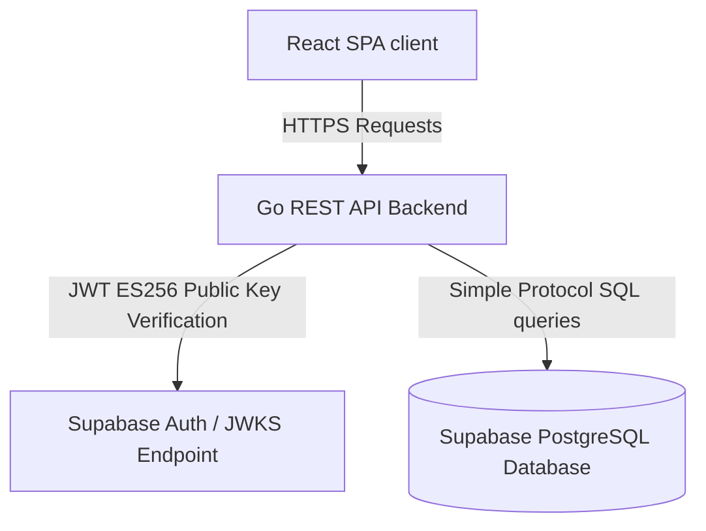
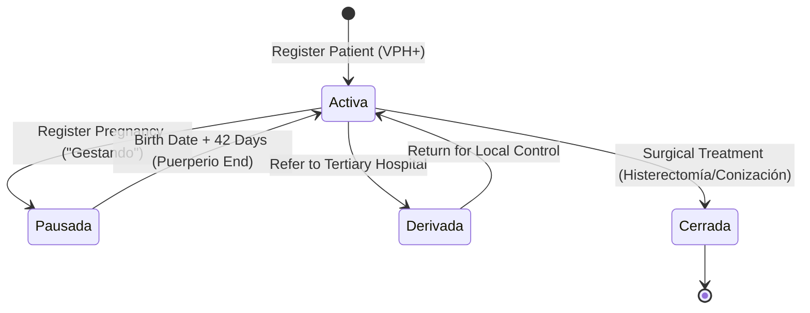

# mari (Clinical tracking & follow-up system for VPH+ patients)

`mari` is a specialized clinical registry and follow-up tracking system designed for health centers (specifically built for P.S. Gran Chimú / Micro Red Porvenir, Peru) to monitor patients who have tested positive for High-Risk Human Papillomavirus (HPV/VPH). The primary objective of the system is to prevent follow-up dropouts by modeling clinical windows, pregnancy freezes, and treatment timelines in a robust, automated state machine.

---

## 1. System Architecture

`mari` is designed as a split monorepo comprising a Go REST API backend and a Vite + React SPA frontend, backed by a PostgreSQL database managed via Supabase.



### Monorepo Structure:
* **/backend**: Go 1.21+ API server managing database transactions, clinical state transitions, and auth middleware.
* **/frontend**: React 19 + TypeScript + Vite single-page application utilizing Vanilla CSS layout systems.

---

## 2. Database Schema

The PostgreSQL schema enforces relational integrity with cascading actions while tracking patient history, pregnancies, treatments, and clinical events.

```mermaid
erDiagram
    PACIENTES ||--|| CONTACTOS : "has contact info"
    PACIENTES ||--o{ GESTACIONES : "can have pregnancy records"
    PACIENTES ||--o{ EVENTOS_CLINICOS : "has clinical history"
    PACIENTES ||--o{ TRATAMIENTOS : "receives treatments"

    PACIENTES {
        int id PK
        varchar dni UNIQUE
        varchar nombres
        varchar historia_clinica
        varchar estado_actual
        timestamp fecha_registro
        boolean eliminado
    }
    CONTACTOS {
        int id PK
        int paciente_id FK
        varchar celular
        text direccion
        varchar distrito
    }
    GESTACIONES {
        int id PK
        int paciente_id FK
        date fecha_probable_parto
        date fecha_nacimiento_real
        date fecha_fin_puerperio
        boolean activa
    }
    EVENTOS_CLINICOS {
        int id PK
        int paciente_id FK
        varchar tipo_evento
        date fecha_evento
        varchar resultado
        varchar establecimiento
        date fecha_proximo_control
        text observaciones
    }
    TRATAMIENTOS {
        int id PK
        int paciente_id FK
        varchar tipo_tratamiento
        date fecha_tratamiento
        varchar ginecologo_responsable
        text observaciones
    }
```

* **Logical Soft Delete**: Rather than running destructive `DELETE` queries, patients are archived by setting `eliminado = TRUE` on the `pacientes` table. The API filters out soft-deleted patient files in both listing and detail requests.

---

## 3. Clinical State Machine & Business Rules

Follow-up rules determine a patient's `estado_actual` (`Activa`, `Pausada`, `Derivada`, `Cerrada`) and calculate the dynamic due date for their next control (`proximo_control`).



### Control Interval Calculations:
* **Normal Colposcopy / Controls**: The next follow-up control is scheduled in **12 months** (`fecha_evento + 1 year`).
* **Positive Colposcopy / NIC Results**: The next follow-up control is scheduled in **6 months** (`fecha_evento + 6 months`).
* **Cryotherapy / Thermocoagulation**: Minor outpatient treatments trigger an automated follow-up window of **6 months**.
* **Major Surgical Actions (Conization / Hysterectomy)**: Triggers an automated case closure (`estado_actual = 'Cerrada'`), ending the tracking loop.
* **Pregnancy Freeze**: When a patient is registered as pregnant, their tracking state changes to `Pausada`. The system pauses active alert indicators. Upon registering a birth, the system calculates `fecha_fin_puerperio` (birth date + 42 days). Once this date is passed, follow-up controls resume.

---

## 4. Technical Implementation Details

### Backend Features:
1. **Supabase Asymmetric JWT Verification (ES256 & HS256)**:
   Modern Supabase projects sign tokens using asymmetric ES256 public/private keys. The Go auth middleware dynamically parses public keys from Supabase's OpenID Connect JSON Web Key Set (JWKS) endpoint (`https://<project-ref>.supabase.co/auth/v1/.well-known/jwks.json`), caching keys thread-safely in memory with a 1-hour expiration. It fallback-validates symmetric HS256 JWT signatures if configured for local dev environments.
2. **PgBouncer Transaction-Mode Compatibility**:
   To prevent prepared statement caching errors (`SQLSTATE 42P05`) when querying Supabase via port `6543` (PgBouncer transaction pooler), the `pgx` driver config has `DefaultQueryExecMode` explicitly set to `QueryExecModeSimpleProtocol`, avoiding named prepared statements.
3. **Idempotency Gates**:
   * **CreatePatient**: Returns the existing ID (`HTTP 200 OK`) if an active DNI is registered again. If the patient was previously soft-deleted, it reactivates them (`eliminado = FALSE`) and updates their contact info.
   * **CreateEvent / CreateTreatment / RegisterBirth**: Checks for pre-existing records with matching criteria (dates, types, IDs) inside database transactions before writing new entries, preventing network double-submission issues.
4. **API Request Logger**:
   Standard routing is wrapped in a logging middleware that prints every incoming route status code, HTTP method, path, and duration in microseconds.

### Frontend Features:
1. **Dynamic Segmented Layouts (Worklist & Calendar)**:
   The application features a toggle between a search-enabled worklist (grouping patients by clinical risk states like *Vencidas* or *En seguimiento*) and a clinical calendar.
2. **Multi-View Clinical Calendar**:
   Implemented in a modular UI component showcasing scheduled controls. It supports **Monthly**, **Weekly**, and **Agenda** views. Selecting any calendar event opens the patient's sidebar dossier details.
3. **Window Focus Re-fetch Defenses**:
   React state triggers fetch actions using primitive string dependencies (`session?.access_token`) instead of object reference observers. This prevents infinite API loop cycles and list flickering during browser tab refocus.
4. **CSS Tokens & Design**:
   Conforms to WCAG 2.1 AA contrast rules. The layout sets `100dvh` viewport constraints to prevent browser scrollbars from breaking panel layouts on touch devices during field work.

---

## 5. Local Development Setup

### Prerequisites
* Go 1.21+ installed.
* Node.js v18+ and `npm` installed.
* A PostgreSQL instance (either local or a Supabase project).

### Configuration

#### 1. Backend Config
Create a `backend/.env` file:
```env
DATABASE_URL="postgres://postgres:<password>@<host>:6543/postgres?sslmode=require"
DIRECT_URL="postgres://postgres:<password>@<host>:5432/postgres?sslmode=require"
SUPABASE_JWT_SECRET="your-supabase-jwt-secret-only-if-using-hs256"
PORT="8080"
```

#### 2. Frontend Config
Create a `frontend/.env` file:
```env
VITE_API_BASE_URL="http://localhost:8080/api"
VITE_SUPABASE_URL="https://your-project.supabase.co"
VITE_SUPABASE_ANON_KEY="your-anon-public-key"
```

### Commands

#### Database Schema & Migration Setup
To run the historical spreadsheet cleaning and initial PostgreSQL database migration:
```powershell
# Inside /backend directory
go run migrate.go
```

#### Launching Backend API
```powershell
# Inside /backend directory
go run cmd/api/main.go
```
The server will bind to `http://localhost:8080` and log incoming requests to standard output.

#### Launching Frontend Client
```powershell
# Inside /frontend directory
npm install
npm run dev
```
The development client will run on `http://localhost:5173`.
